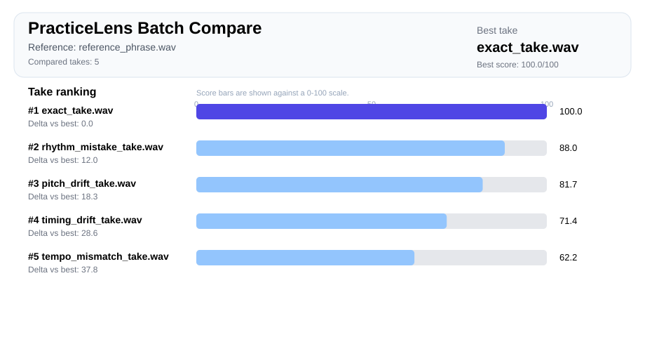

# PracticeLens


**PracticeLens** is a local-first audio practice review tool for singing and instrument takes.

It helps you turn raw practice recordings into a concrete loop:

```text
record several takes -> find the strongest take -> identify the recurring weakness -> get a practice plan -> compare progress later
```

PracticeLens is still **pre-alpha**, but it already has a real end-to-end workflow for local practice review and first-pass progress tracking.

## Project direction

PracticeLens is a private practice-review tool for musicians who can already attempt a phrase, riff, or take and want objective feedback before asking other people.

It is currently strongest for short clean monophonic or near-monophonic reference-based review. Polyphony, chords, heavy effects, beginner tutoring, and full transcription are future directions, not current promises.

Important docs:

- [Product positioning](docs/product_positioning.md)
- [Roadmap](docs/roadmap.md)
- [Maintainer AI usage](docs/maintainer_ai_usage.md)
- [Known limitations](docs/known_limitations.md)
- [Real audio usage guide](docs/real_audio_usage.md)
- [Real audio smoke workflow](examples/real_audio/README.md)

## Quick demo

PracticeLens compares practice takes against a reference, identifies recurring weaknesses, and generates next-practice guidance.



Example generated audio:

**Reference phrase**

<audio controls preload="none" src="https://raw.githubusercontent.com/kymuco/practicelens/main/docs/assets/demo/audio/reference_phrase.mp3"></audio>

[Reference phrase MP3](docs/assets/demo/audio/reference_phrase.mp3) / [OGG](docs/assets/demo/audio/reference_phrase.ogg)

**Exact take**

<audio controls preload="none" src="https://raw.githubusercontent.com/kymuco/practicelens/main/docs/assets/demo/audio/exact_take.mp3"></audio>

[Exact take MP3](docs/assets/demo/audio/exact_take.mp3) / [OGG](docs/assets/demo/audio/exact_take.ogg)

**Pitch drift take**

<audio controls preload="none" src="https://raw.githubusercontent.com/kymuco/practicelens/main/docs/assets/demo/audio/pitch_drift_take.mp3"></audio>

[Pitch drift take MP3](docs/assets/demo/audio/pitch_drift_take.mp3) / [OGG](docs/assets/demo/audio/pitch_drift_take.ogg)

**Timing drift take**

<audio controls preload="none" src="https://raw.githubusercontent.com/kymuco/practicelens/main/docs/assets/demo/audio/timing_drift_take.mp3"></audio>

[Timing drift take MP3](docs/assets/demo/audio/timing_drift_take.mp3) / [OGG](docs/assets/demo/audio/timing_drift_take.ogg)

Example generated artifacts:

- [Practice plan](docs/assets/demo/practice_plan.md)
- [Batch report](docs/assets/demo/batch_report.md)
- [Visual report](docs/assets/demo/report.svg)

See the full showcase: [Evaluation showcase](examples/evaluation_showcase/README.md)

## Golden path

Run a practice session with several takes:

```bash
practicelens practice-session \
  --reference path/to/reference.wav \
  --take path/to/take_01.wav \
  --take path/to/take_02.wav \
  --take path/to/take_03.wav \
  --out out/session-a \
  --history-index .practicelens/sessions/index.jsonl
```

PracticeLens writes a session folder with human-readable and machine-readable artifacts, then appends one compact entry to the explicit history index.

List previous indexed sessions:

```bash
practicelens sessions list --limit 5
```

Example output:

```text
1  2026-05-16  out/session-a  best=take_02.wav  score=88.4  focus=rhythm_fidelity
2  2026-05-17  out/session-b  best=take_03.wav  score=90.1  focus=timing_consistency
```

Open one session:

```bash
practicelens sessions show 1
```

Compare two sessions:

```bash
practicelens sessions compare 1 2
```

Example comparison:

```text
Overall score: +3.2
Recurring weakness: rhythm_fidelity -> timing_consistency
Best take: improved
Stable area: preserved (section_stability)
```

The history index is opt-in. PracticeLens does not create hidden databases or background state unless you explicitly pass `--history-index`.

## What PracticeLens answers

PracticeLens is built around a better practice question than **"did that sound good?"**:

**where did this take diverge from the reference, which take is strongest, and what should I practice before recording again?**

It currently focuses on:

- local WAV analysis;
- reference-aware alignment;
- pitch, rhythm, timing, and section-stability signals;
- input suitability and confidence warnings;
- explainable scoring instead of opaque judgment;
- single-take review;
- multi-take comparison;
- practice-session summaries;
- local session history and first-pass progress comparison.

## What works today

| Area | Current status |
| --- | --- |
| WAV loading and preprocessing | Working |
| Deterministic feature extraction | Working |
| Reference-aware DTW alignment | Working |
| Explainable scoring | Working |
| Input suitability summary | Working |
| Duration/start-region diagnostics | Working |
| Low-confidence Markdown warnings | Working |
| JSON / Markdown / CSV / SVG artifacts | Working |
| Practice plans and diagnostics artifacts | Working |
| Single-take CLI analysis | Working |
| Multi-take batch comparison | Working |
| Practice-session CLI review | Working |
| Session manifest artifact | Working |
| Opt-in session history index | Working |
| `sessions list/show/compare` | Working |
| Optional FastAPI surface | Working |
| GitHub Actions CI | Working |

## Install

```bash
pip install -e .[dev]
```

Optional API extras:

```bash
pip install -e .[dev,api]
```

## CLI workflows

### Analyze one take

```bash
practicelens analyze \
  --reference path/to/reference.wav \
  --take path/to/take.wav \
  --out out/single
```

Outputs:

- `report.json`
- `report.md`
- `report.csv`
- `report.svg`
- `practice_plan.md`
- `debug_payload.json`

### Compare multiple takes

```bash
practicelens compare-batch \
  --reference path/to/reference.wav \
  --take path/to/take_01.wav \
  --take path/to/take_02.wav \
  --take path/to/take_03.wav \
  --out out/batch
```

Batch outputs:

- `batch_report.json`
- `batch_report.md`
- `batch_report.csv`
- `batch_report.svg`
- `practice_plan.md`
- `session_manifest.json`
- per-take artifact folders under `out/takes/`

### Run a practice session

```bash
practicelens practice-session \
  --reference path/to/reference.wav \
  --take path/to/take_01.wav \
  --take path/to/take_02.wav \
  --take path/to/take_03.wav \
  --out out/session
```

`practice-session` uses the same analysis engine as `compare-batch`, but prints a musician-oriented summary:

- best take;
- weakest take;
- recurring weakness;
- next recording target;
- generated `practice_plan.md` path.

Add an explicit local history entry:

```bash
practicelens practice-session \
  --reference path/to/reference.wav \
  --take path/to/take_01.wav \
  --take path/to/take_02.wav \
  --take path/to/take_03.wav \
  --out out/session \
  --history-index .practicelens/sessions/index.jsonl
```

### List indexed practice sessions

```bash
practicelens sessions list
```

Use a custom index or show only recent entries:

```bash
practicelens sessions list \
  --history-index path/to/index.jsonl \
  --limit 5
```

The printed 1-based ids can be reused with `sessions show` and `sessions compare`.

### Show one practice session

```bash
practicelens sessions show out/session
practicelens sessions show out/session/session_manifest.json
practicelens sessions show 1 --history-index .practicelens/sessions/index.jsonl
```

Output includes:

- best take;
- weakest take;
- recurring weakness;
- next recording target;
- `practice_plan.md` path;
- `batch_report.md` path.

### Compare two practice sessions

```bash
practicelens sessions compare old/session new/session
practicelens sessions compare old/session/session_manifest.json new/session/session_manifest.json
practicelens sessions compare 1 2 --history-index .practicelens/sessions/index.jsonl
```

The comparison reports:

- overall best-take score delta;
- recurring weakness transition;
- best take improved / declined / unchanged;
- stable area preserved / changed / unknown.

### Shared tuning flags

- `--sample-rate`
- `--frame-length`
- `--hop-length`
- `--segment-duration`

## Which artifact should I open first?

For one take:

1. `practice_plan.md` — shortest path to the next concrete practice action
2. `report.svg` — fastest visual overview
3. `report.md` — readable explanation
4. `report.json` / `report.csv` — structured inspection
5. `debug_payload.json` — developer diagnostics

For several takes or a practice session:

1. top-level `practice_plan.md`
2. `batch_report.md`
3. `session_manifest.json`
4. `batch_report.svg`
5. per-take reports under `takes/`

See [docs/artifacts.md](docs/artifacts.md) for the detailed artifact guide.

## Evaluate it quickly

Recommended reading order:

1. [Quickstart](docs/quickstart.md)
2. [CLI walkthrough](docs/cli_walkthrough.md)
3. [Real audio usage guide](docs/real_audio_usage.md)
4. [Real audio smoke workflow](examples/real_audio/README.md)
5. [Known limitations](docs/known_limitations.md)
6. [Evaluation showcase](examples/evaluation_showcase/README.md)
7. [Showcase review checklist](docs/showcase_review.md)
8. [Architecture overview](docs/architecture.md)
9. [API notes](docs/api.md)
10. [Roadmap](docs/roadmap.md)
11. [Maintainer AI usage](docs/maintainer_ai_usage.md)

Generate the synthetic evaluation showcase from the repository root:

```bash
make generate-evaluation-showcase
```

On Windows, use the equivalent Python command if `make` is not installed:

```bash
python tools/generate_evaluation_showcase.py
```

Generated showcase files are local review artifacts and are intentionally not committed to the repository.

## Optional API usage

PracticeLens exposes an optional FastAPI app with:

- `GET /health`
- `POST /analyze`
- `POST /compare-batch`
- `POST /practice-session`

Run locally:

```bash
uvicorn practicelens.api.app:app --reload
```

See [docs/api.md](docs/api.md) and [examples/api](examples/api) for payload examples.

## Current scope

PracticeLens v0.1 is intentionally bounded.

Current expectations:

- local-first execution;
- offline reference-based analysis;
- monophonic or near-monophonic material first;
- deterministic baseline first;
- explainable component scoring;
- input suitability and confidence warnings;
- single-take, batch, and practice-session review.

Current non-goals:

- realtime feedback;
- polyphonic-first analysis;
- cloud-first infrastructure;
- end-to-end learned scoring;
- full transcription;
- artistic judgment or interpretation scoring;
- pretending the project is production-complete.

See [Known limitations](docs/known_limitations.md) before using PracticeLens on real recordings.

## Development workflow

```bash
ruff check .
pytest tests
python -m build
```
