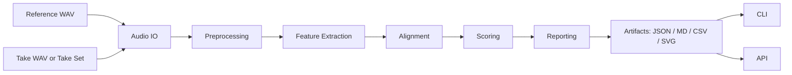

# PracticeLens Architecture

PracticeLens is intentionally structured as a **bounded local-first analysis stack**.

The current architecture is designed to keep the core deterministic and explainable, while still allowing the project to grow into stronger CLI, API, and future model-assisted layers.

## High-level flow

## Layer responsibilities

### 1. IO and preprocessing

These layers normalize raw local audio input into a bounded internal shape.

Responsibilities:

- WAV loading;
- sample validation;
- resampling;
- peak normalization;
- silence trimming.

Goal:

Keep messy raw input from leaking directly into the feature and scoring layers.

### 2. Feature extraction

The feature layer computes the deterministic bundle used by the rest of the stack.

Responsibilities:

- time axis;
- energy curve;
- zero-crossing rate;
- pitch contour;
- voiced mask;
- onset timing;
- tempo estimate.

Goal:

Expose enough signal structure for scoring and reporting without jumping prematurely into opaque learned scoring.

### 3. Alignment

The alignment layer is reference-aware.

Responsibilities:

- compare the extracted reference and take feature bundles;
- build a DTW-style path between comparable frames;
- make later scoring explicit rather than heuristic hand-waving.

Goal:

Make scoring depend on actual aligned evidence instead of vague similarity guesses.

### 4. Scoring

The scoring layer converts aligned signal evidence into explainable results.

Current score dimensions include:

- pitch fidelity;
- rhythm fidelity;
- timing consistency;
- section stability.

Goal:

Produce a report that is interpretable and debuggable.

### 5. Reporting and artifacts

The reporting layer converts analysis results into useful outputs.

Current artifacts include:

- JSON report;
- Markdown report;
- CSV report;
- SVG summary;
- batch comparison summaries.

Goal:

Support both machine-readable and human-readable workflows.

### 6. Application workflows

The application layer orchestrates the real user-facing analysis modes.

Current workflows:

- single-take analysis;
- multi-take batch comparison.

Goal:

Keep orchestration separate from pure signal-processing logic.

### 7. Surfaces

PracticeLens currently exposes two practical entry layers:

- CLI;
- optional FastAPI app.

Goal:

Keep the core reusable while exposing friendly outer surfaces.

## Boundary principles

The current architecture follows a few practical rules:

- **deterministic core first**;
- **local-first execution first**;
- **explainable outputs over opaque magic**;
- **thin outer surfaces**;
- **report artifacts as first-class outputs**.

## Why this shape is useful

This structure gives the project a few strong properties:

- CLI and API do not need to own signal-processing logic;
- batch comparison builds on the same single-analysis pipeline instead of forking behavior;
- report formats can grow without rewriting the whole scoring layer;
- future ML scoring can be added on top of a stable deterministic baseline instead of replacing everything chaotically.

## What is intentionally not here yet

The current repo does **not** try to solve everything at once.

Still intentionally bounded:

- realtime feedback;
- advanced polyphonic analysis;
- cloud-first orchestration;
- final release-grade scoring semantics;
- learned ranking models.

## Related docs

- [docs/quickstart.md](quickstart.md)
- [docs/api.md](api.md)
- [docs/development.md](development.md)
- [docs/repository-map.md](repository-map.md)
